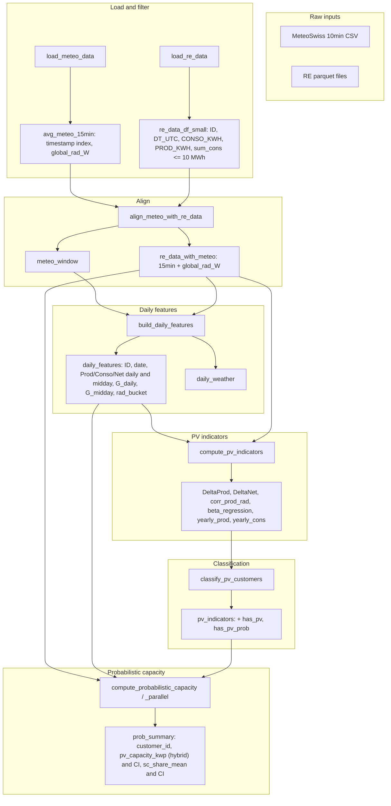
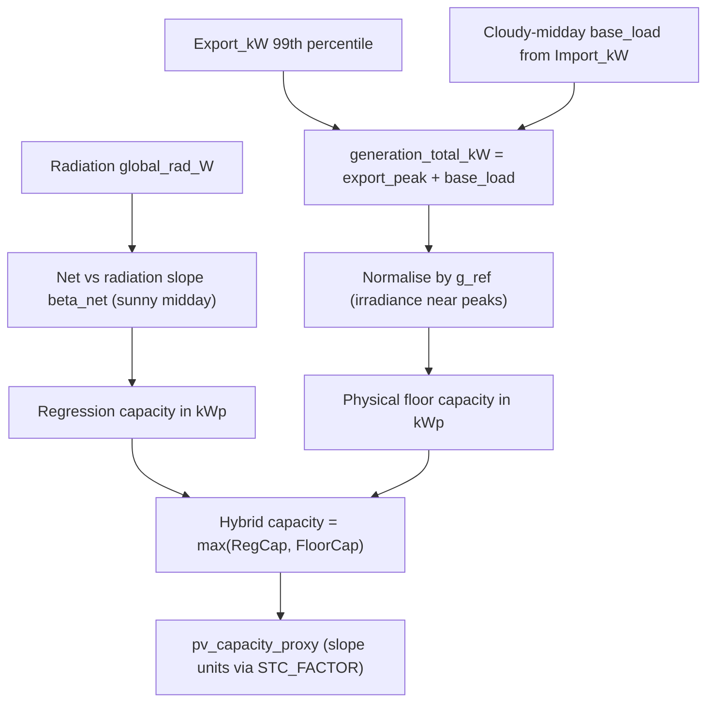
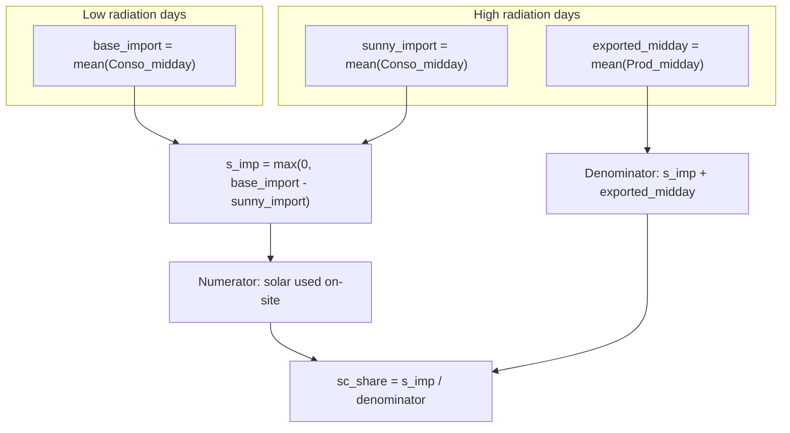
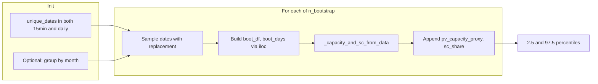

# PV Detection and Size Estimation — Detailed Technical Report

*Full technical traceability for `model/pv_detection.py`*

---

## 1. Overview and Pipeline Diagram

The pipeline takes two raw inputs—MeteoSwiss radiation and Romande Energie (RE) smart meter parquet data—and produces (1) per-customer PV indicators and a binary/continuous classification, and (2) probabilistic capacity (kWp) and self-consumption share with 95% confidence intervals. All core analysis steps are implemented in `model/pv_detection.py`; data loading delegates to `data/envdata.py` and `data/load_smart_meter.py`.

**End-to-end data flow:**

---

## 2. Data Loading and Alignment

### 2.1 `load_meteo_data` (L25–41)

- **Purpose:** Load MeteoSwiss data and produce a single regional 15-minute radiation series.
- **Implementation:** Calls `meteo.env_data()` in `data/envdata.py`, which fetches historical CSV from Geo.Admin for a fixed list of stations (Biere, St.Prex, Vevey/Corseaux, Villars-Tiercelin, Mathod, Bullet/La Fretaz). Each station provides 10-minute series; columns used: `tre200s0` → `t_2m_C`, `gre000z0` → `global_rad_W`, plus wind and snow. Stations are stacked, then averaged per timestamp (`groupby(level=0).mean()`), yielding one regional series.
- **In pv_detection:** Index is converted to `DatetimeIndex` (UTC), sorted, then resampled to 15 min with `.resample("15min").mean()`.
- **Outputs:**
  - `combined_meteo`: stacked per-station records (not used further in the pipeline).
  - `avg_meteo_15min`: DataFrame with timestamp index and at least `global_rad_W`; used as the radiation reference for the rest of the pipeline.

### 2.2 `load_re_data` (L44–68)

- **Purpose:** Load all RE smart meter parquet files and restrict to customers with total consumption ≤ 10 MWh.
- **Implementation:** Uses `re_data.load_all_data_generator(data_dir)` with `data_dir = repo_root / "data" / "re_data" / "ETHZ"`. Each parquet is loaded with columns `ID`, `DT_UTC`, `CONSO_KWH`, `PROD_KWH`; IDs are cast to string, `DT_UTC` to datetime. All DataFrames are concatenated. Then:
  - Aggregate by `ID`: `sum_cons_kwh`, `sum_prod_kwh`, `dt_start`, `dt_end`.
  - Filter: `customer_summary[sum_cons_kwh <= 10000]` (10 MWh).
  - Restrict rows: `re_data_df_small = re_data_df[re_data_df["ID"].isin(ids["ID"])]`.
- **Outputs:**
  - `re_data_df`: full loaded data.
  - `re_data_df_small`: only customers with `sum_cons_kwh <= 10000`.
  - `customer_summary`: one row per ID with sums and date range.

### 2.3 `align_meteo_with_re_data` (L71–96)

- **Purpose:** Restrict radiation to the RE data time window and attach one radiation value per 15-min meter record.
- **Implementation:** `first_dt = re_data_df_small["DT_UTC"].min()`, `last_dt = re_data_df_small["DT_UTC"].max()`. Meteo is sliced: `meteo_window = avg_meteo_15min.loc[first_dt:last_dt].copy()`. Then `meteo_window[["global_rad_W"]]` is reset_index (index renamed to `DT_UTC`) and left-merged onto `re_data_df_small` on `DT_UTC`.
- **Outputs:** `meteo_window`, `re_data_with_meteo` (each meter row has a `global_rad_W` value for that timestamp).

---

## 3. Daily Features

### 3.1 `build_daily_features` (L99–211)

**Purpose:** Build a (customer, date) table with daily and midday energy aggregates and a daily radiation classification (low/medium/high) for later PV indicators and self-consumption.

**Weather branch:**

- Meteo index is renamed to `timestamp`; derived: `date`, `hour`, and `is_midday = (hour >= 10) & (hour < 16)`.
- **G_daily:** `groupby("date")["global_rad_W"].sum()`.
- **G_midday:** same sum restricted to `is_midday`.
- **rad_bucket:** For each date, the day’s `G_midday` is compared to **monthly** quantiles of `G_midday` (20th and 80th percentile per month). If `G_midday <=` 20th percentile → `"low"`; if `>=` 80th → `"high"`; else `"medium"`; if `G_midday` is NaN → `"unknown"`.
- Output: `daily_weather` with columns `date`, `G_daily`, `G_midday`, `month`, `rad_bucket`.

**Customer branch:**

- From `re_data_with_meteo`: `date`, `hour`; midday mask = hour in [10, 16).
- **Daily:** `groupby(["ID", "date"])` → sum of `PROD_KWH` → `Prod_daily`, sum of `CONSO_KWH` → `Conso_daily`; then `Net_daily = Conso_daily - Prod_daily`.
- **Midday:** same aggregates on rows with midday mask → `Prod_midday`, `Conso_midday`, `Net_midday`.
- Daily and midday customer aggregates are merged on `["ID", "date"]`, then merged with `daily_weather` on `"date"`.

**Outputs:** `daily_features` (ID, date, Prod/Conso/Net daily and midday, G_daily, G_midday, rad_bucket, month), `daily_weather`.

---

## 4. PV Indicators

### 4.1 `compute_pv_indicators` (L214–304)

**Purpose:** One row per customer with: high-vs-low radiation midday deltas, 15-min correlation and regression slope of export vs radiation, and yearly totals.

**DeltaProd / DeltaNet:**

- Restrict `daily_features` to `rad_bucket == "high"` and to `rad_bucket == "low"`.
- Per ID: mean of `Prod_midday` and `Net_midday` on high days → `Prod_midday_high`, `Net_midday_high`; on low days → `Prod_midday_low`, `Net_midday_low`.
- `DeltaProd = Prod_midday_high - Prod_midday_low`, `DeltaNet = Net_midday_high - Net_midday_low`. Joined in a single table (outer join on ID).

**corr_prod_rad and beta_regression:**

- Per ID, on `re_data_with_meteo`: drop rows with NaN in `global_rad_W`. If variance of `global_rad_W` or `PROD_KWH` is 0, return `corr_prod_rad = np.nan`, `beta_regression = 0.0`. Otherwise:
  - **corr_prod_rad:** Pearson correlation between `PROD_KWH` and `global_rad_W`.
  - **beta_regression:** OLS slope of `PROD_KWH` on `global_rad_W`: β = Σ(x−x̄)(y−ȳ) / Σ(x−x̄)² (no intercept in the slope formula; intercept is implicit when centring). Implemented in a per-group `corr_and_beta` applied with `groupby("ID")`.

**Yearly aggregates:**

- `yearly_prod = sum(PROD_KWH)`, `yearly_cons = sum(CONSO_KWH)` per ID.

**Assembly:** Delta table, corr/beta table, and yearly table are joined (outer). Index `ID` is reset and renamed to `customer_id`. Result: one row per customer with columns `customer_id`, `DeltaProd`, `DeltaNet`, `corr_prod_rad`, `beta_regression`, `yearly_prod`, `yearly_cons`.

---

## 5. Classification

### 5.1 `classify_pv_customers` (L307–334)

**Purpose:** Add a binary PV flag and a continuous “probability-like” score.

**Rule for `has_pv` (OR of four conditions):**

- `yearly_prod > min_yearly_prod` (default 1.0 kWh), or  
- `corr_prod_rad > corr_threshold` (default 0.3), or  
- `DeltaProd > 0.01`, or  
- `DeltaNet < delta_net_threshold` (default −0.1).

Missing values are filled with 0 for the comparison. So: any non-trivial yearly export, or clear correlation with radiation, or higher export on sunny days, or lower net import on sunny days, yields `has_pv = True`.

**has_pv_prob:**

- `corr = corr_prod_rad.fillna(0.0)`.
- `has_pv_prob = np.clip((corr - 0.1) / 0.4, 0.0, 1.0)`. So correlation 0.1 → 0, 0.5 → 1; outside [0.1, 0.5] clipped.
- For rows with `has_pv == False`, `has_pv_prob` is set to 0.

So the score is correlation-driven and only non-zero for customers classified as having PV.

---

## 6. Capacity and Self-Consumption (Core Logic)

### 6.1 `_fit_simple_slope` (L641–663)

**Purpose:** Ordinary least squares for y = α + βx; return (β, se_β).

- Mask: keep only finite x and y.
- If n < 3 or Σ(x−x̄)² = 0: return (0.0, np.nan).
- β = Σ(x−x̄)(y−ȳ) / Σ(x−x̄)².  
- α = ȳ − β x̄.  
- Residuals e = y − (α + βx).  
- σ² = Σe² / (n−2) (dof = max(n−2, 1)).  
- se_β = √(σ² / Σ(x−x̄)²).

Used for Net_KWH vs radiation and for PROD_KWH vs radiation.

### 6.2 `_capacity_and_sc_from_data` (L810–977)

**Purpose:** From 15-min and daily data for one customer, compute a **hybrid PV capacity estimate** and self-consumption share (no bootstrap).

**Inputs:** `cust_df` (15-min, must have `global_rad_W`, `CONSO_KWH`, `PROD_KWH`; `date` added by caller) and `cust_days` (daily features for that ID with `rad_bucket`, `Conso_midday`, `Prod_midday`).

**High-level idea:** combine two complementary views:

- A **statistical view** from a regression of net load vs radiation (what the slope suggests under sunny conditions).
- A **physical floor** based on robust export peaks and a cloudy-day base load (how big the system must be to explain observed export and import patterns).

The final capacity in kWp is the **maximum** of these two, expressed via a common scale factor.

**Step 1 — Preprocessing and masks**

1. Drop rows with NaN in `global_rad_W`. If empty, return zeros/nans for all metrics.
2. Add `date` and `hour` columns from `DT_UTC`.
3. Map a daily radiation bucket onto each 15-min row (if `rad_bucket` exists in `cust_days`), so each interval is tagged as `low`, `medium`, `high`, or `unknown`.
4. Compute `Net_KWH = CONSO_KWH − PROD_KWH`.

**Step 2 — Regression capacity (sunny midday slope)**

- Compute a **baseline slope** on all available data:
  - `(full_beta_net, full_beta_net_se) = _fit_simple_slope(global_rad_W, Net_KWH)`.
- Define masks:
  - Midday: `10 ≤ hour < 16`.
  - Sunny: `rad_bucket == "high"`.
- Restrict to **sunny midday** intervals and recompute:
  - `(reg_beta_net, reg_beta_net_se) = _fit_simple_slope(global_rad_W, Net_KWH)` on this subset.
  - If the subset is empty, fall back to `(full_beta_net, full_beta_net_se)`.
- Set:
  - `beta_net = reg_beta_net` and `beta_net_se = reg_beta_net_se` (the slope actually used downstream).

Interpretation: `beta_net` measures how much net import changes when radiation changes, focusing on hours where a PV signal is strongest. With PV, more sun → lower net import → negative slope.

In parallel, the function also computes an **export slope** on intervals with positive export:

- Restrict to rows with `PROD_KWH > 0` and compute:
  - `(beta_export, beta_export_se) = _fit_simple_slope(global_rad_W, PROD_KWH)` on that subset, or `(0.0, nan)` if empty.

This export slope is a lower-bound diagnostic (how strongly export alone responds to radiation).

From the net slope, a **regression-based capacity proxy** is formed in internal “slope units”:

- `pv_capacity_proxy_regression = max(0.0, -beta_net)`.
- `regression_capacity_kwp = pv_capacity_proxy_regression * STC_FACTOR`.

**Step 3 — Physical floor (robust export peak + cloudy base load)**

The physical floor encodes the idea: *a system that regularly exports X kW at midday and still supplies a non-trivial base load cannot be much smaller than some minimum size*.

1. Convert 15-min energies to **instantaneous power**:
  - `Import_kW = CONSO_KWH * 4.0`
  - `Export_kW = PROD_KWH * 4.0`
2. **Cloudy-midday base load** (self-consumed part):
  - Cloudy-midday mask: midday hours with `rad_bucket == "low"`.
  - Take the 20th percentile of `Import_kW` on these intervals as `sc_base_kW`. This is a conservative estimate of demand the PV often covers before any export appears.
3. **Robust export peak**:
  - Across all intervals, take the 99th percentile of `Export_kW` as `export_peak_kW`. This ignores extreme outliers while capturing typical peak production.
4. Combine into a **total generation level**:
  - `generation_total_kW = max(0, export_peak_kW) + max(0, sc_base_kW)`.
5. **Reference irradiance** near export peaks:
  - If `export_peak_kW > 0`, identify intervals where `Export_kW >= export_peak_kW` and compute the mean `global_rad_W` there (`g_ref`). If that fails, fall back to the 95th percentile of `global_rad_W`.
6. Convert this generation level to a **physical capacity in kWp**:
  - If `generation_total_kW > 0` and `g_ref > 0`, set  
   `floor_capacity_kwp = generation_total_kW * 1000.0 / g_ref`  
   else `floor_capacity_kwp = 0.0`.

**Step 4 — Hybrid capacity and internal proxy**

The regression estimate and physical floor are combined:

- `hybrid_capacity_kwp = max(regression_capacity_kwp, floor_capacity_kwp)`.
- `pv_capacity_proxy = hybrid_capacity_kwp / STC_FACTOR`.

So `pv_capacity_proxy` is no longer just `max(0, -beta_net)`; it is the **hybrid capacity** expressed back in the original slope units using the same scaling factor as in the pure regression case. This ensures that all downstream code treating `pv_capacity_proxy` and its bootstrapped distribution remains consistent.

**Self-consumption share (unchanged conceptual logic)**

Self-consumption is derived from daily midday imports and exports on low vs high radiation days:

1. From `cust_days`, split into:
  - `hi`: days with `rad_bucket == "high"`.
  - `lo`: days with `rad_bucket == "low"`.
2. Compute:
  - `base_import = mean(Conso_midday)` on low-rad days.
  - `sunny_import = mean(Conso_midday)` on high-rad days.
3. Define:
  - `s_imp = max(0, base_import − sunny_import)` (midday import “saved” on sunny days).
  - `exported_midday = mean(Prod_midday)` on high-rad days.
4. Self-consumption share:
  - If the denominator `s_imp + max(exported_midday, 0)` is > 0:  
   `sc_share = s_imp / (s_imp + max(exported_midday, 0))`,  
   else `sc_share = nan`.

Interpretation: of the midday PV production visible on sunny days (sum of reduced import plus export), `s_imp` is the part used on-site, so `sc_share` is the share of that production that directly reduces grid draw.

**Hybrid capacity logic (schematic):**

**Self-consumption logic (schematic):**

### 6.3 STC_FACTOR = 4000 (L1094–1095)

**Purpose:** Convert between the slope-like proxy (in units of (kWh/15 min)/(W/m²)) and kWp, both for the regression estimate and the hybrid capacity.

- **Per 15-min interval:** energy in kWh per 15 min → power in kW = (kWh/15min)×4 (four 15-min in one hour).
- **Per W/m²:** to express capacity at standard irradiance 1000 W/m², multiply by 1000.
- So (kWh/15min)/(W/m²) × 4 × 1000 = kWp → **STC_FACTOR = 4000**.  
In code, the regression-only capacity is `regression_capacity_kwp = max(0, -beta_net) * STC_FACTOR`,  
and the hybrid proxy is `pv_capacity_proxy = hybrid_capacity_kwp / STC_FACTOR`.

---

## 7. Bootstrap and Probabilistic Summary

### 7.1 `_bootstrap_capacity_and_sc` (L980–1091)

**Purpose:** For one customer, obtain distributions of the **hybrid capacity proxy** and self-consumption share by day-level resampling.

**Setup:**

- Precompute `date_to_idx_df` and `date_to_idx_days`: for each date, the row indices in `cust_df` and `cust_days` (requires `cust_df` to have a `date` column). Restrict to dates present in both. If fewer than 3 such dates, return (None, None).
- If `stratify_by_month` (default True): group these dates by month; per month keep a sorted array of dates. This preserves seasonal structure when resampling.

**Each bootstrap iteration:**

1. **Sample dates with replacement:**
  - If stratified: for each month, sample n_days_m dates from that month with replacement (block_size=1 in current use, so no blocking). Concatenate all months.  
  - If not stratified: sample from the full sorted list of dates with replacement.
2. **Resample data:** For the sampled date list, form index arrays: `idx_df = concat(date_to_idx_df[d] for d in sampled_dates)`, `idx_days = concat(date_to_idx_days[d] for d in sampled_dates)`. Then `boot_df = cust_df.iloc[idx_df]`, `boot_days = cust_days.iloc[idx_days]`.
3. Call `_capacity_and_sc_from_data(boot_df, boot_days)` and append the **hybrid** `pv_capacity_proxy` and `sc_share` to lists.

**Return:** Two arrays of length `n_bootstrap`: capacity proxy samples (each corresponding to a hybrid capacity) and self-consumption share samples.

**Bootstrap loop (schematic):**

### 7.2 `compute_probabilistic_capacity` (L1240–1322) and `compute_probabilistic_capacity_parallel` (L1166–1237)

**Purpose:** For every customer in `pv_indicators`, compute point estimates and 95% CIs for **hybrid capacity (kWp)** and self-consumption share.

**Implementation (serial version):**

- Pre-group: `dict_re_data = dict(re_data_with_meteo.groupby("ID"))`, `dict_daily = dict(daily_features.groupby("ID"))` for O(1) customer lookup.
- For each row in `pv_indicators`: get `customer_id`; retrieve that customer’s 15-min and daily DataFrames; add `date` to the 15-min DataFrame.
- Call `_capacity_and_sc_from_data` for the point estimate; this returns:
  - `pv_capacity_proxy` (hybrid, in slope units),
  - `pv_capacity_regression_kwp`,
  - `pv_capacity_floor_kwp`,
  - `pv_capacity_hybrid_kwp`,
  - and `sc_share`.
- Call `_bootstrap_capacity_and_sc` with `n_bootstrap` (default 200), independent RNG seeds, stratify_by_month=True, block_size=1. This re-runs the **entire hybrid-capacity computation** on each bootstrap resample.
- From bootstrap arrays: 95% CI = 2.5th and 97.5th percentiles of the capacity proxy and self-consumption share.
- Build one output row per customer with:
  - `customer_id`,
  - `has_pv_prob` (from `pv_indicators`),
  - `pv_capacity_mean` (hybrid proxy),
  - `pv_capacity_ci_lower/upper` (proxy),
  - `pv_capacity_kwp` (= `pv_capacity_hybrid_kwp`),
  - `pv_capacity_kwp_ci_lower/upper` (proxy CIs × `STC_FACTOR`),
  - `pv_capacity_kwp_regression_only`,
  - `pv_capacity_kwp_floor`,
  - `floor_to_reg_ratio` (= floor / regression, when regression > 0),
  - `sc_share_mean`, `sc_share_ci_lower/upper`.

`compute_probabilistic_capacity_parallel` is a ProcessPool-based variant that processes customers in batches but is **statistically equivalent**: it calls the same `_capacity_and_sc_from_data` and `_bootstrap_capacity_and_sc` helpers and produces the same columns, just computed in parallel for performance.

---

## 8. Visualization Functions (Brief)

| Function                              | Purpose                                                                                                                                                                                                                                                   |
| ------------------------------------- | --------------------------------------------------------------------------------------------------------------------------------------------------------------------------------------------------------------------------------------------------------- |
| `plot_customer_timeseries`            | Single-customer time series: CONSO_KWH, PROD_KWH, global_rad_W (optional start/end).                                                                                                                                                                      |
| `plot_customer_high_low_profile`      | Average daily profile (15-min) on high vs low radiation days for one customer (import and export).                                                                                                                                                        |
| `plot_population_statistics`          | Population histograms and scatter plots: corr_prod_rad, beta_regression, beta vs yearly_prod, DeltaProd vs DeltaNet; optional color by has_pv.                                                                                                            |
| `plot_capacity_vs_production_with_ci` | Scatter: hybrid pv_capacity_kwp vs yearly_prod with 95% CI error bars on capacity; optional colour by floor-to-regression ratio.                                                                                                                          |
| `plot_capacity_vs_self_consumption`   | Scatter: hybrid pv_capacity_kwp vs sc_share_mean (0–1).                                                                                                                                                                                                   |
| `plot_customer_heatmap`               | Net load (CONSO − PROD) heatmap by hour of day and month for one customer; RdBu_r with midpoint 0 (“solar belly” visible as blue midday band).                                                                                                            |
| `plot_customer_capacity_validation`   | For a given customer’s **peak week**, overlay Import_kW and Export_kW on the estimated hybrid capacity (kWp) with 95% CI and optional regression-only and physical-floor lines; intended as a sanity check that the capacity ceiling tracks export peaks. |
| `plot_yearly_customer_capacity`       | Same as `plot_customer_capacity_validation` but for the **entire year**, using WebGL (`Scattergl`) to handle the full-resolution time series without crashing the browser; useful to inspect whether the capacity ceiling is plausible across seasons.    |

Conceptually, these plots serve two roles:

- **Population level:** understand how indicators, capacities, and self-consumption behave across all customers (histograms and scatter plots).
- **Single-customer diagnostics:** visually cross-check that the hybrid capacity estimate and its confidence interval are consistent with the observed import/export profiles (capacity-overlaid plots and heatmaps).

---

## 9. Assumptions and Limitations

- **Single regional radiation:** One averaged MeteoSwiss series is used for all customers. Local shading, orientation, or albedo are not modelled; this can bias capacity and self-consumption for individual sites.
- **STC conversion:** kWp is derived assuming 1000 W/m² (STC). Real performance ratio and irradiance variability are not explicitly modelled in the factor.
- **Radiation buckets:** “High” and “low” are defined by monthly 20th/80th percentiles of G_midday, so they are season-relative. This reduces seasonal bias when comparing sunny vs cloudy behaviour.
- **Bootstrap:** Day-level resampling assumes that days are exchangeable within (and across) months for the purpose of estimating uncertainty. Serial correlation at sub-day level is not modelled; stratification by month preserves seasonal balance.
- **Hybrid capacity from slope and floor:** The capacity estimate combines a regression-based view (−β_net, focused on sunny midday) with a physically motivated floor from export peaks and cloudy-day base load. This guards against unrealistically small regression estimates when clear export peaks are present but does not “fix” all modelling issues.
- **Self-consumption formula:** The share is derived from midday high-rad vs low-rad import and high-rad export. It is a proxy for “share of PV used on-site” during that window, not a full-day or annual self-consumption rate.
- **Missing data:** Rows with NaN in global_rad_W are dropped in regression and in daily aggregates; many missing days can shrink effective sample size and widen CIs or produce NaN outputs.
- **Small n:** Customers with very few days in both 15-min and daily data may get None from bootstrap or wide CIs; _fit_simple_slope returns 0/nan for n < 3 or zero variance.
- **Unobserved site factors:** As before, orientation, shading, inverter clipping, curtailment, and local microclimate are not modelled explicitly. Both the regression and the physical floor inherit these limitations; the hybrid capacity should be interpreted as a robust statistical estimate, not a ground-truth physical measurement for any given installation.

---

*This report documents the behaviour of model*`/pv_detection.py` *as of the reviewed version. For a management-level summary and a single end-to-end schematic, see the High-Level Report.*