# PV Detection and Size Estimation — High-Level Report

*For management and non-technical stakeholders*

---

## 1. What Problem We Solve

We need to know which customers have rooftop solar panels (PV) and how big those installations are—without visiting sites or asking customers directly.

This report describes a method that uses only two inputs: **smart meter data** (how much each customer imports and exports from the grid every 15 minutes) and **weather data** (solar radiation in the region). From these we:

- **Detect** which customers likely have PV.
- **Estimate** the installed PV size in kilowatt-peak (kWp).
- **Estimate** how much of the solar production is used at home (self-consumption) versus fed back to the grid.

That information supports grid planning, marketing, and understanding the local solar fleet.

---

## 2. Data We Use

**Smart meter data (Romande Energie)**  
For each customer we have 15-minute records of:

- **Import** (CONSO_KWH): energy drawn from the grid.
- **Export** (PROD_KWH): energy sent to the grid (e.g. from PV).

The analysis is run on a subset of customers whose total annual consumption is **10 MWh or less**, to focus on typical residential/small commercial profiles.

**Weather data (MeteoSwiss)**  
We use **solar radiation** (global irradiance in W/m²) from several stations in the region, averaged and resampled to 15-minute steps so it lines up with the smart meter data.

No other data (no addresses, no site visits, no panel specifications) is required.

---

## 3. How We Know Someone Has PV (In Plain Language)

The logic is intuitive:

- **If a customer has PV:** When the sun is strong, they export more to the grid and often import less. So **export tends to go up and down with sunshine**.
- **If a customer has no PV:** Export is zero or unrelated to sunshine; import may follow lifestyle (e.g. evening peaks) but not solar radiation.

We combine several signals:

1. **Yearly export** — Do they export at all over the year?
2. **Correlation** — Does their export go up when radiation goes up (and down when it’s cloudy)?
3. **Sunny vs cloudy days** — On days we classify as “sunny” (high radiation around midday), do they export more and have lower net import (import minus export) than on “cloudy” (low radiation) days?

From these we get:

- A **yes/no** flag: “this customer is classified as having PV.”
- A **score between 0 and 1** (“probability-like”) indicating how strong the PV signal is—useful for prioritisation and campaigns.

---

## 4. How We Estimate Size (In Plain Language)

For customers we believe have PV, we combine **two complementary views**:

- A **statistical view**: *“When the sun gets stronger by one unit, how much does this customer’s net import from the grid go down?”*
- A **physical safety floor**: *“Given how high their solar export peaks are and how much load they still cover at midday, how small could their system realistically be?”*

Concretely:

- **Net import** = import − export. With PV, more sun usually means less net import (more self-consumption and/or more export). The **slope** of “net import vs. radiation” during sunny midday hours tells us how sensitive the customer is to sunshine; we turn that slope into a capacity estimate in **kWp** using a standard conversion based on typical solar conditions.
- At the same time, we look at **robust export peaks** and the customer’s **typical cloudy-day midday demand**. A system that regularly exports several kilowatts and still covers a base load cannot be extremely small; this reasoning gives us a **lower bound** (a physical “floor”) on the kWp.

The final capacity estimate is a **hybrid of these two**: we do not allow the statistical estimate to fall below the physically plausible floor. This makes the result more robust in cases where noisy data or behavioural effects would otherwise suggest an unrealistically small system.

Because this hybrid estimate is built from real, sometimes noisy data, it comes with uncertainty. We therefore **resample the days many times** (a statistical technique called bootstrap): each time we pretend we only had a random subset of days and recompute the entire hybrid estimate. From that we get a **range** (e.g. “between 3 and 5 kWp”) rather than a single number. That range is our **confidence interval** and reflects how stable the estimate is.

---

## 5. Self-Consumption (Plain Language)

When the sun is shining, a customer with PV does two things with the solar energy:

- **Use some at home** — so their import from the grid goes down.
- **Send the rest to the grid** — that’s what we see as export.

**Self-consumption share** is: *“What fraction of the solar production (during sunny midday) was used at home?”*

We approximate it by comparing:

- **Import on cloudy days** (no solar, so import reflects normal consumption).
- **Import on sunny days** (solar covers part of consumption → lower import).
- **Export on sunny days** (the part not used at home).

The “saved” import (cloudy minus sunny import) is the part we attribute to solar used on-site. We put that in relation to total solar production (saved import + export) to get a share between 0 and 1. That helps understand how much PV is reducing grid draw vs. feeding the grid.

---

## 6. End-to-End Process (Schematic)

The following diagram shows how we go from raw data to the results we use for decisions.

```mermaid
flowchart LR
    subgraph inputs [Inputs]
        Meteo[MeteoSwiss Radiation]
        RE[Smart Meter RE Data]
    end

    subgraph align [Align]
        Merge[Merge radiation with meter data]
    end

    subgraph daily [Daily Features]
        WeatherFeat[Weather: daily and midday radiation]
        CustFeat[Customer: daily and midday import and export]
        Bucket[Classify days: low or high radiation]
    end

    subgraph indicators [PV Indicators]
        Delta[Sunny vs cloudy differences]
        Corr[Correlation export vs radiation]
        Yearly[Yearly totals]
    end

    subgraph classify [Classification]
        HasPV[PV yes or no]
        Score[PV probability score]
    end

    subgraph capacity [Capacity and Self-Consumption]
        StatCap[Statistical view: net import vs sunshine]
        PhysFloor[Physical floor: export peaks + base load]
        Hybrid[Hybrid capacity estimate]
        Bootstrap[Resample days many times]
        CI[95% confidence intervals]
    end

    subgraph outputs [Outputs]
        Out1[PV yes or no and score]
        Out2[kWp estimate and range]
        Out3[Self-consumption share]
    end

    Meteo --> Merge
    RE --> Merge
    Merge --> WeatherFeat
    Merge --> CustFeat
    WeatherFeat --> Bucket
    CustFeat --> Bucket
    Bucket --> Delta
    Merge --> Corr
    Merge --> Yearly
    Delta --> indicators
    Corr --> indicators
    Yearly --> indicators
    indicators --> HasPV
    indicators --> Score

    HasPV --> StatCap
    HasPV --> PhysFloor
    StatCap --> Hybrid
    PhysFloor --> Hybrid
    Hybrid --> Bootstrap
    Bootstrap --> CI

    HasPV --> Out1
    Score --> Out1
    CI --> Out2
    CI --> Out3
```

---

## 7. What the Numbers Mean for Decisions

| Result | What it is | How you can use it |
|--------|------------|---------------------|
| **PV yes/no** | Whether we classify the customer as having PV | Targeting (e.g. campaigns for non-PV), grid planning, reporting on PV penetration. |
| **PV probability score** | Strength of the PV signal (0–1) | Prioritising which “PV” customers to treat as most certain; filtering for high-confidence lists. |
| **Estimated capacity (kWp)** | Estimated size of the installation | Fleet size, capacity maps, understanding distribution of system sizes. |
| **Capacity range (confidence interval)** | Lower and upper bound of the kWp estimate | Understanding uncertainty; avoiding over-interpreting a single number. |
| **Self-consumption share** | Fraction of PV production used on-site | Understanding how much PV relieves local demand vs. feeds the grid; storage or flexibility discussions. |

---

## 8. Limitations (Short Summary)

The method is based on **statistical patterns** (correlation and regression) between meter and weather data. We do **not** have a physical measurement of the panels (no site visit, no installer data). Estimates assume typical conditions (e.g. standard solar irradiance for the kWp conversion) and one regional weather series for all customers. Factors such as **shading**, **orientation**, or **inverter behaviour** can make individual estimates less accurate. The confidence intervals from the bootstrap reflect variability in the data we have, not these unobserved factors. For high-stakes decisions on a single customer, additional checks (e.g. comparison with other sources) may be appropriate; for fleet-level and planning use, the approach is well suited.

---

*This report summarizes the logic of the PV detection and size estimation pipeline implemented in `model/pv_detection.py`. For formulas, function-level detail, and full technical traceability, see the Detailed Technical Report.*
