# Data Summarization Visualization Report

## Project Overview
This document summarizes the `all_sources_load_with_weather.parquet` dataset and compares it against historical figures from **Romande Energy**.

### Romande Energy Data Overview
* **Total Unique Customers:** 2,916
* **Prosumers (with PV):** 2,893 (99.2%)
* **Consumers Only:** 23 (0.8%)
* **Total Energy Consumed:** 26.54 GWh
* **Total Energy Produced:** 182.68 GWh
* **Ratio:** ~6.9x -> Much more generation than consumption.

*(Here are the reference Romande Energy historical plots for comparison)*

**2-Week Profile:**


**Average Daily Profile:**


**Customer Base by Annual Consumption Size:**


---

## Dataset Summaries

### Sample Amounts
The following charts display the distribution of unique customers by source and by appliance type.

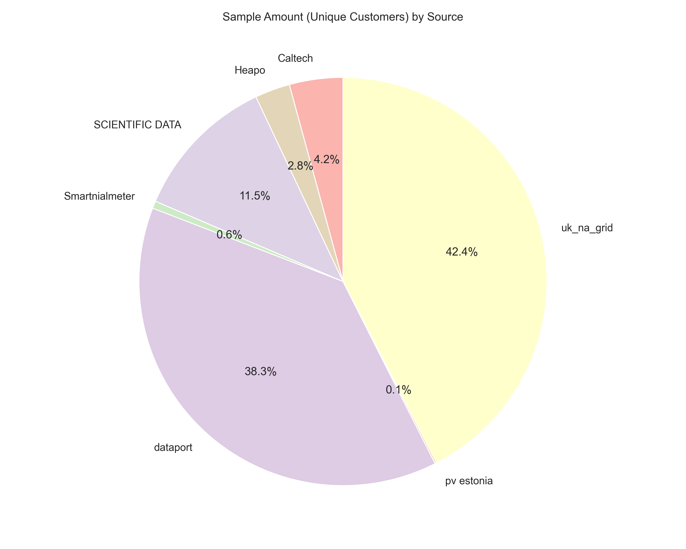

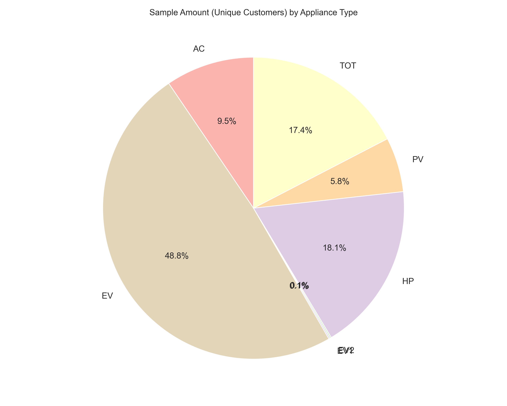

### Average Size
This grouping compares the average load size (kW) across sources and types.

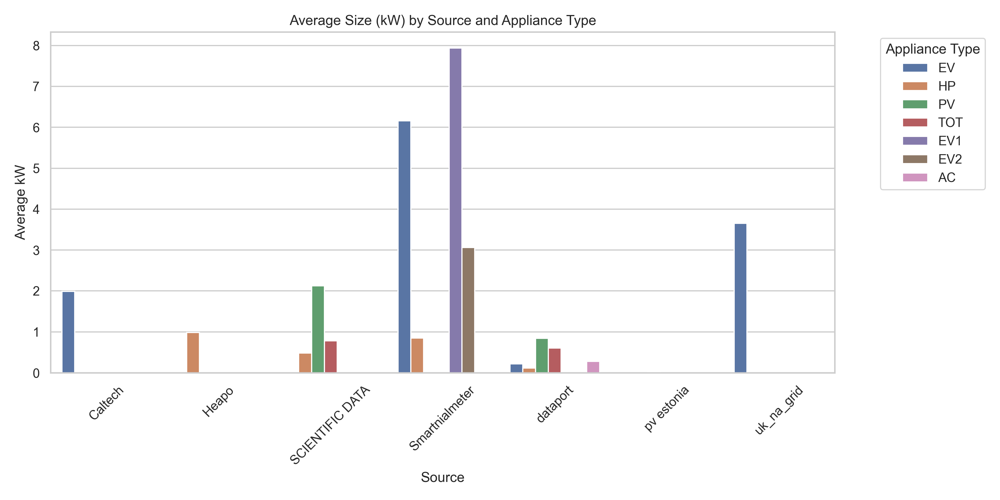

### Average Daily Profiles
Average power usage distributed over a 24-hour period, comparing different sources per appliance type.

````carousel
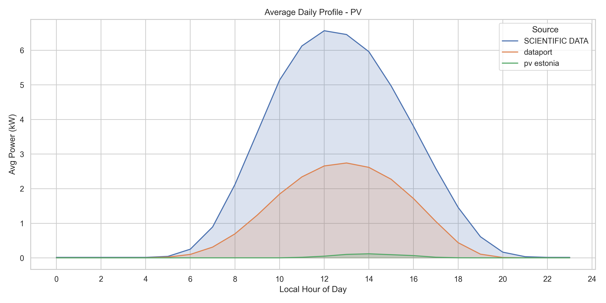
<!-- slide -->
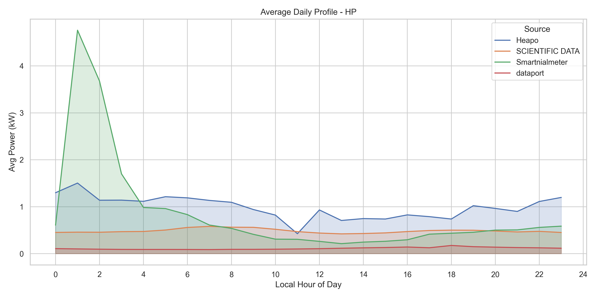
<!-- slide -->
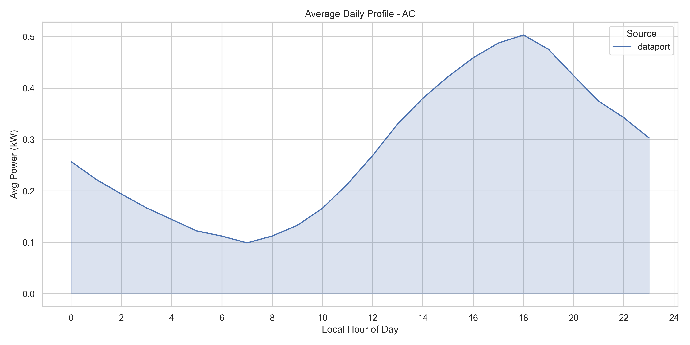
<!-- slide -->
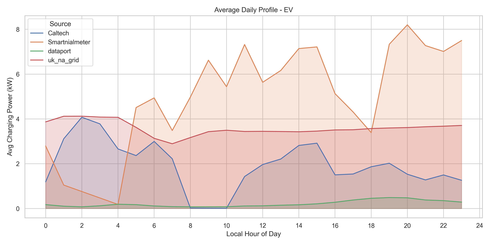
<!-- slide -->
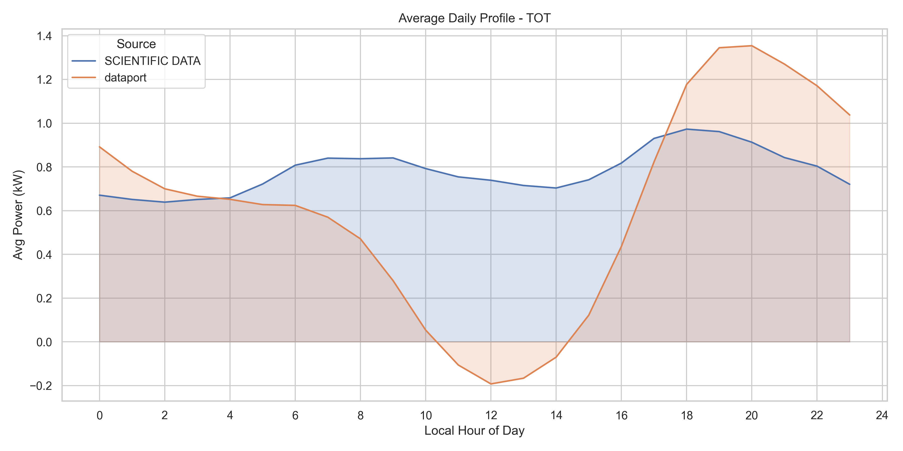
````

### Yearly Profiles
Average power distribution over the months of the year, comparing different sources per appliance type.

````carousel
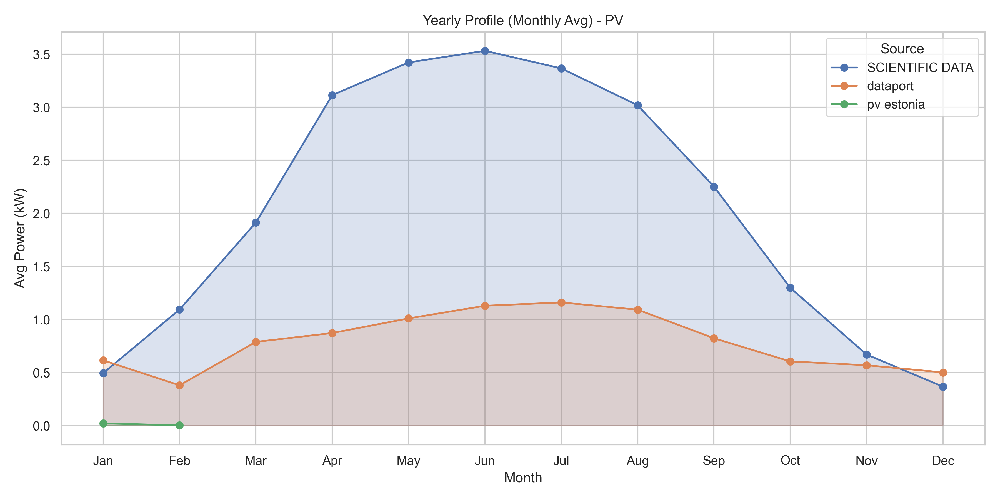
<!-- slide -->
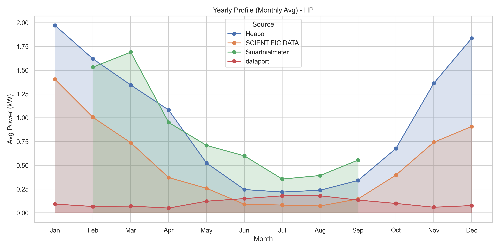
<!-- slide -->
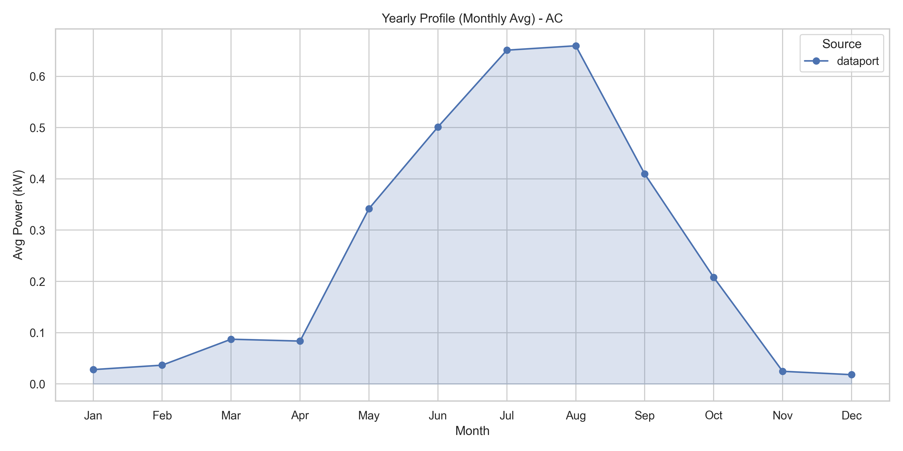
<!-- slide -->
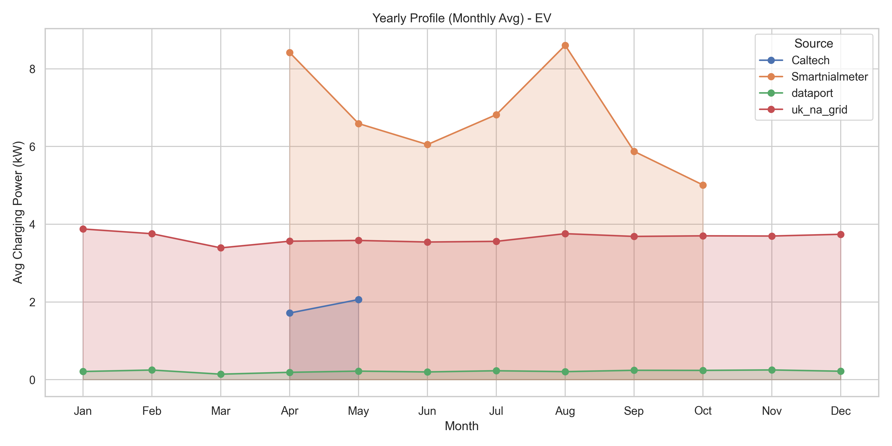
<!-- slide -->
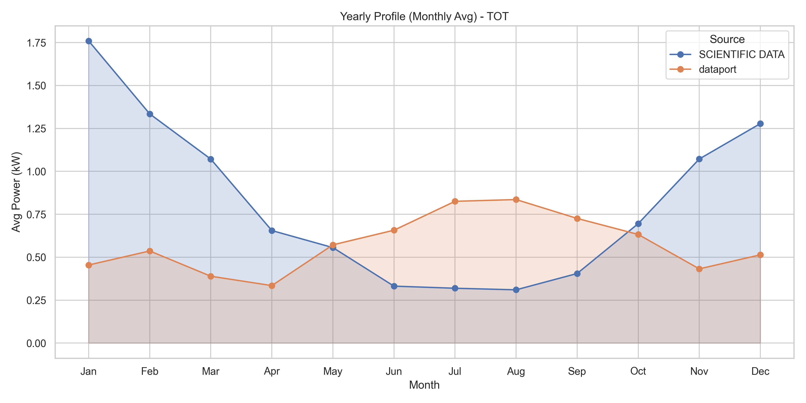
````
